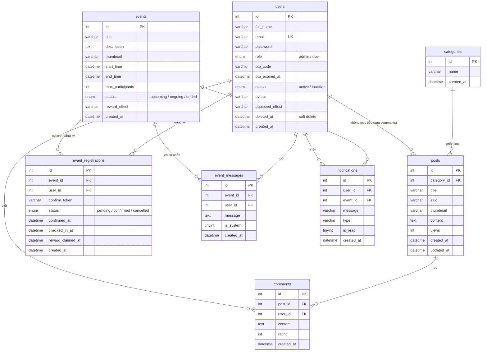

# TechNews — Nền tảng tin tức công nghệ & quản lý sự kiện

Ứng dụng web full-stack gồm trang tin tức công nghệ và hệ thống quản lý sự kiện có tương tác (đăng ký, check-in, nhận thưởng, group chat, trợ lý AI). Dự án được xây dựng theo kiến trúc tách biệt frontend và backend, giao tiếp qua REST API.

## Mục lục
- [Tính năng chính](#tính-năng-chính)
- [Công nghệ sử dụng](#công-nghệ-sử-dụng)
- [Kiến trúc tổng quan](#kiến-trúc-tổng-quan)
- [Cấu trúc thư mục](#cấu-trúc-thư-mục)
- [Sơ đồ cơ sở dữ liệu (ERD)](#sơ-đồ-cơ-sở-dữ-liệu-erd)
- [Cài đặt và chạy](#cài-đặt-và-chạy)
- [Cấu hình](#cấu-hình)
- [Một số luồng nghiệp vụ](#một-số-luồng-nghiệp-vụ)
- [Hạn chế và hướng phát triển](#hạn-chế-và-hướng-phát-triển)

## Tính năng chính

**Người dùng**
- Xem danh sách và chi tiết bài viết theo danh mục, bình luận và đánh giá bài viết.
- Đăng ký tài khoản (xác thực qua email OTP), đăng nhập, đổi/quên mật khẩu.
- Đăng ký tham gia sự kiện qua liên kết xác nhận gửi vào email.
- Check-in khi sự kiện đang diễn ra và nhận thưởng sau khi sự kiện kết thúc.
- Tham gia group chat của sự kiện (chỉ dành cho người đã xác nhận).
- Hỏi đáp với trợ lý AI về thông tin sự kiện.
- Tùy biến ảnh đại diện và gắn hiệu ứng avatar mở khóa được từ phần thưởng sự kiện.

**Quản trị viên**
- Dashboard thống kê tổng quan với biểu đồ.
- Quản lý người dùng (khóa/mở khóa, soft-delete và khôi phục, thùng rác).
- Quản lý bài viết, danh mục, sự kiện (CRUD, phân trang, tìm kiếm).
- Xem danh sách đăng ký từng sự kiện, gửi thông báo hệ thống vào group chat.

## Công nghệ sử dụng

**Frontend**
- React (Hooks) + Vite
- React Router (điều hướng SPA)
- Axios (gọi REST API)
- CSS thuần (animation, hiệu ứng)

**Backend**
- PHP thuần (không framework) theo mô hình tương tự MVC
- MySQL
- PHPMailer (gửi email SMTP)
- Tích hợp Groq API cho trợ lý AI

## Kiến trúc tổng quan

Frontend và backend là hai ứng dụng độc lập, giao tiếp qua HTTP với dữ liệu định dạng JSON.

```
Người dùng (trình duyệt)
        |
   React SPA  ── axiosClient (gắn token, baseURL) ──>  REST API (PHP)
        |                                                    |
   React Router                                        index.php (entry point)
        |                                                    |
   Component + Hooks                                    api.php (router)
                                                             |
                                                   routes/*.php  ->  models/*.php  ->  MySQL
                                                             |
                                                   jsonResponse() (JSON trả về)
```

Backend dùng mô hình **front controller**: mọi request được `.htaccess` viết lại về `index.php`, sau đó `api.php` đọc đường dẫn (`$_GET["url"]`) và định tuyến tới file xử lý tương ứng. Xác thực dùng cơ chế **token stateless**: backend không lưu phiên, client gửi token trong header `Authorization` mỗi request.

## Cấu trúc thư mục

```
project/
├── fe/                      # Frontend (React + Vite)
│   └── src/
│       ├── main.jsx         # Điểm khởi động, render App
│       ├── App.jsx          # Định tuyến (React Router)
│       ├── config.js        # URL gốc của backend
│       ├── api/
│       │   └── axiosClient.js   # Cấu hình axios + gắn token
│       ├── layouts/         # UserLayout, AdminLayout
│       ├── pages/           # Các trang (Home, EventDetail, admin/...)
│       ├── components/      # Header, Avatar, NotificationBar, ...
│       ├── constants/       # effects.js (danh sách hiệu ứng)
│       └── styles/          # CSS
│
└── be/                      # Backend (PHP)
    ├── index.php            # Entry point
    ├── .htaccess            # Rewrite URL + truyền header Authorization
    ├── config/              # Database.php, env.php
    ├── routes/              # api.php (router) + route theo nhóm
    ├── app/models/          # Lớp Model truy vấn DB
    ├── helpers/             # response, jwt, mail, ai
    ├── middleware/          # AuthMiddleware (checkAuth, checkAdmin)
    └── assets/uploads/      # Ảnh upload (posts, events, avatars)
```

## Sơ đồ cơ sở dữ liệu (ERD)

Cơ sở dữ liệu `tech_news` gồm 8 bảng. Sơ đồ dưới đây thể hiện các thực thể và quan hệ giữa chúng (GitHub tự render khối `mermaid`).



### Mô tả các bảng

| Bảng | Vai trò |
|------|---------|
| `users` | Tài khoản người dùng (admin/user), hỗ trợ OTP, khóa tài khoản (status), avatar, hiệu ứng đang gắn, và xóa mềm (`deleted_at`). |
| `categories` | Danh mục bài viết. |
| `posts` | Bài viết, thuộc một danh mục, có lượt xem. |
| `comments` | Bình luận của người dùng trên bài viết, kèm đánh giá (rating). |
| `events` | Sự kiện, có thời gian, trạng thái tự cập nhật, và hiệu ứng phần thưởng. |
| `event_registrations` | Bảng trung gian giữa user và event; lưu trạng thái đăng ký, mốc xác nhận, check-in và nhận thưởng. |
| `event_messages` | Tin nhắn trong group chat sự kiện; cờ `is_system` đánh dấu thông báo hệ thống. |
| `notifications` | Thông báo gửi tới người dùng, có thể gắn với một sự kiện. |

### Các quan hệ chính

- **categories → posts** (1–n): một danh mục có nhiều bài viết. (`posts.category_id`)
- **posts → comments** (1–n) và **users → comments** (1–n): mỗi bình luận thuộc một bài viết và một người dùng. (`ON DELETE CASCADE`)
- **events ↔ users** qua **event_registrations** (n–n): một người dùng tham gia nhiều sự kiện và ngược lại; ràng buộc `UNIQUE(event_id, user_id)` đảm bảo mỗi người chỉ đăng ký một sự kiện một lần.
- **events ↔ users** qua **event_messages** (n–n): tin nhắn trong group chat.
- **users → notifications** và **events → notifications**: thông báo gắn với người dùng và (tùy chọn) một sự kiện; dùng `ON DELETE SET NULL` để giữ lại thông báo khi user/event bị xóa.

### Ghi chú thiết kế

- **Soft delete:** bảng `users` dùng cột `deleted_at` thay vì xóa thật; có index `idx_users_deleted_at` để lọc nhanh.
- **Khóa duy nhất chống trùng:** `event_registrations` có `UNIQUE(event_id, user_id)`; `comments` có `UNIQUE(user_id, post_id)` (mỗi người một bình luận/đánh giá cho mỗi bài).
- **Quyền sở hữu hiệu ứng avatar không lưu riêng** mà suy ra từ các `event_registrations` đã `reward_claimed_at`, kết hợp `events.reward_effect`.

## Cài đặt và chạy

### Yêu cầu
- Node.js (cho frontend)
- PHP 8+ và MySQL (khuyến nghị dùng XAMPP cho môi trường local)
- Composer (để cài PHPMailer) hoặc dùng thư mục `vendor/` có sẵn

### Backend
1. Đặt thư mục `be/` vào thư mục web của server (ví dụ `htdocs/` của XAMPP).
2. Tạo database MySQL và import file SQL trong thư mục `database/`.
3. Cấu hình kết nối trong `be/config/Database.php` và các khóa trong `be/config/env.php` (xem mục [Cấu hình](#cấu-hình)).

### Frontend
```bash
cd fe
npm install
npm run dev      # chạy môi trường phát triển
npm run build    # build ra thư mục dist/ để deploy
```
Sửa `fe/src/config.js` để trỏ `API_URL` tới địa chỉ backend (local hoặc host).

## Cấu hình

File `be/config/env.php` chứa các thông tin nhạy cảm (không commit lên Git):
- Thông tin SMTP để gửi email.
- `GROQ_API_KEY` cho trợ lý AI.
- `APP_BASE_URL` dùng cho liên kết trong email.

File `be/config/Database.php` chứa thông tin kết nối MySQL (host, user, password, database).

> Lưu ý: nên thêm `env.php` và `Database.php` vào `.gitignore`. Cung cấp file mẫu `env.example.php` để người khác biết cần khai báo những gì.

## Một số luồng nghiệp vụ

**Đăng ký và tham gia sự kiện**
1. Người dùng đăng ký sự kiện → hệ thống tạo bản ghi (trạng thái chờ) và gửi email xác nhận.
2. Người dùng bấm liên kết trong email → trạng thái chuyển sang đã xác nhận → được vào group chat.
3. Khi sự kiện diễn ra → người dùng check-in.
4. Sau khi sự kiện kết thúc và đã check-in → nhận thưởng (mở khóa hiệu ứng avatar).

Trạng thái sự kiện (sắp diễn ra / đang diễn ra / đã kết thúc) được cập nhật tự động dựa trên thời gian bắt đầu và kết thúc.

**Hệ thống hiệu ứng avatar (gamification)**
Mỗi sự kiện gắn một hiệu ứng phần thưởng. Khi người dùng nhận thưởng từ sự kiện, họ mở khóa hiệu ứng tương ứng và có thể gắn lên avatar. Danh sách hiệu ứng sở hữu được suy ra từ các sự kiện đã nhận thưởng (không lưu trùng lặp).

**Trợ lý AI**
Người dùng đặt câu hỏi trong group chat → backend ghép dữ liệu thật của sự kiện và trạng thái người dùng vào prompt → gọi Groq API → trả lời. Khóa API được giữ ở backend, không lộ ra frontend.

## Hạn chế và hướng phát triển
- Token xác thực hiện ở mức cơ bản (mã hóa base64), chưa có chữ ký số và thời gian hết hạn; hướng nâng cấp là dùng JWT chuẩn (HMAC) và lưu token an toàn hơn (cookie HttpOnly).
- Group chat dùng cơ chế polling định kỳ; có thể nâng cấp lên WebSocket để cập nhật tức thời và giảm tải.
- Một số chức năng phụ thuộc dịch vụ ngoài (email SMTP, Groq API) có thể bị giới hạn trên một số nền tảng hosting miễn phí.

---

Dự án được xây dựng cho mục đích học tập, thực hành kiến trúc full-stack và triển khai ứng dụng web thực tế.
